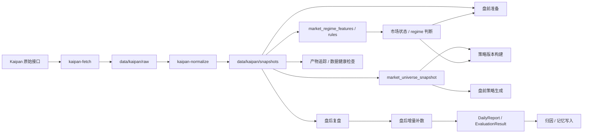
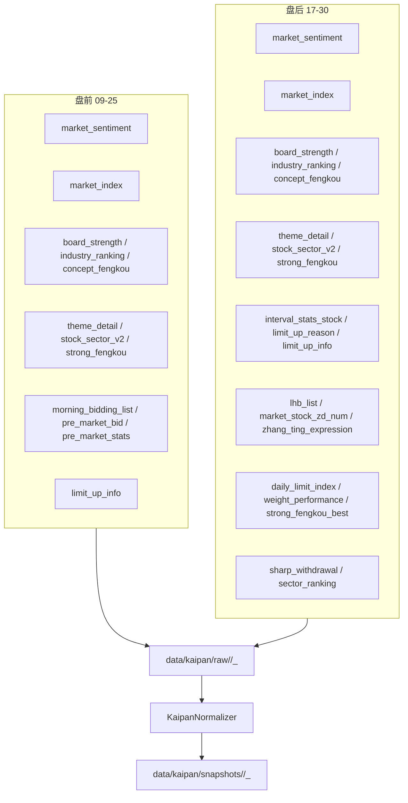
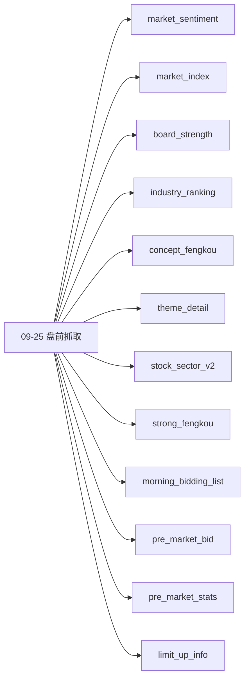
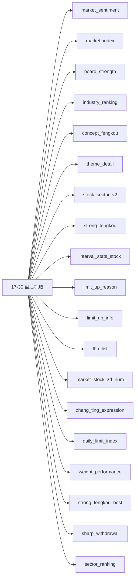
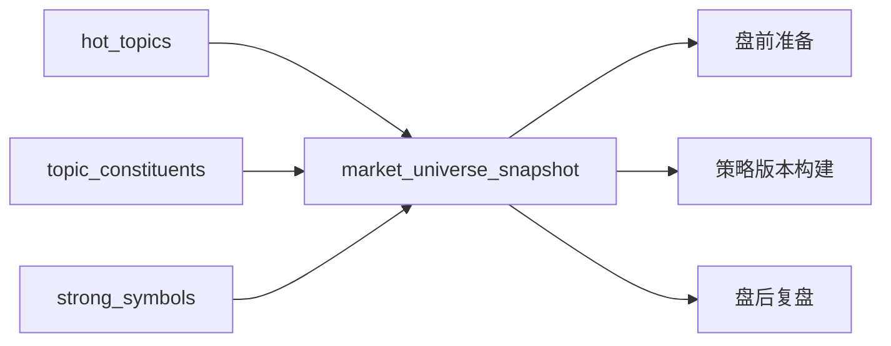

# Kaipan 数据流向

本文说明 `Kaipan` 相关数据从“抓取”到“标准化”再到“下游消费”的完整流向，重点回答两件事：

1. `kaipan-fetch` 会抓哪些数据
2. 这些数据最终会流向哪里，哪些会直接参与策略生成

---

## 流程图版总览

如果只看一张图，先看这张：



### 这张图的阅读方式

- 左边是 `Kaipan` 原始接口和抓取动作
- 中间是 `raw -> normalize -> snapshots`
- 右边是三条下游主链路：
  - `market_universe_snapshot` 直接参与策略生成
  - `market_regime_features / rules` 影响市场状态和规则选择
  - `盘后复盘` 先补数，再做评估和归因

### 最关键的一句话

- **不是所有 Kaipan 数据都会直接进入策略本体**
- **真正直接参与策略生成的是 `hot_topics / topic_constituents / strong_symbols` 形成的快照**
- **其余数据更多是帮助市场状态判断、规则选择和盘后分析**

---

## 1. 总览

```text
Kaipan 原始接口
  ├─ 09-25 盘前抓取
  └─ 17-30 盘后抓取
        ↓
data/kaipan/raw/<dataset>/<trade_date>_<slot>/<dataset>.json
        ↓
KaipanNormalizer
        ↓
data/kaipan/snapshots/<dataset>/<trade_date>_<slot>/<dataset>.json
        ↓
市场候选池快照 / 市场状态特征 / 盘前盘后流程 / 规则选择 / 产物追踪
```

核心结论：

- `kaipan-fetch` 是**抓取层**
- `kaipan-normalize` 是**标准化层**
- 真正直接进入策略生成的，不是所有原始接口，而是标准化后的一部分快照数据

### 抓取层和标准化层的关系



这张图更强调的是：

- `kaipan-fetch` 先把原始数据抓到 `raw`
- `kaipan-normalize` 再把 `raw` 变成统一快照
- 下游策略、市场状态、盘后复盘都从 `snapshots` 往下读

---

## 2. `kaipan-fetch` 会抓哪些数据

`kaipan-fetch` 的实现位于 [src/services/kaipan_service.py](../src/services/kaipan_service.py)。

它按时段分两类：

### 2.1 盘前 `09-25`

盘前会抓取这些数据：



- `market_sentiment`
- `market_index`
- `board_strength`
- `industry_ranking`
- `concept_fengkou`
- `theme_detail`
- `stock_sector_v2`
- `strong_fengkou`
- `morning_bidding_list`
- `pre_market_bid`
- `pre_market_stats`
- `limit_up_info`

### 2.2 盘后 `17-30`

盘后会抓取这些数据：



- `market_sentiment`
- `market_index`
- `board_strength`
- `industry_ranking`
- `concept_fengkou`
- `theme_detail`
- `stock_sector_v2`
- `strong_fengkou`
- `interval_stats_stock`
- `limit_up_reason`
- `limit_up_info`
- `lhb_list`
- `market_stock_zd_num`
- `zhang_ting_expression`
- `daily_limit_index`
- `weight_performance`
- `strong_fengkou_best`
- `sharp_withdrawal`
- `sector_ranking`

### 2.3 `all` 模式

如果 `slot=all`，会把 `09-25` 和 `17-30` 都跑一遍。

---

## 3. `kaipan-normalize` 会使用哪些数据

`kaipan-normalize` 的实现位于 [src/providers/kaipan_normalizer.py](../src/providers/kaipan_normalizer.py)。

它不发请求，只读取 `data/kaipan/raw/` 里的原始文件，然后转换成统一快照。

### 3.1 会读取的 dataset

`normalize_date()` 会批量处理这些 dataset：

- `hot_topics`
- `topic_constituents`
- `strong_symbols`
- `market_sentiment`
- `market_index`
- `sharp_withdrawal`
- `sector_ranking`
- `market_context`
- `market_stock_zd_num`
- `zhang_ting_expression`
- `daily_limit_index`
- `weight_performance`
- `get_feng_k_list`

### 3.2 输入输出路径

- 输入：`data/kaipan/raw/<dataset>/<trade_date>_<slot>/<dataset>.json`
- 输出：`data/kaipan/snapshots/<dataset>/<trade_date>_<slot>/<dataset>.json`

### 3.3 标准化会做什么

标准化层会：

- 统一历史/今日接口字段差异
- 按 YAML schema 把 raw JSON 映射成结构化列表
- 将不同来源的数据写成统一的 snapshot JSON

---

## 4. 哪些数据直接参与策略生成

不是所有 Kaipan 数据都会直接进入策略生成。

### 4.1 直接参与的核心数据

这三类最核心：

- `hot_topics`
- `topic_constituents`
- `strong_symbols`

它们会组成 `market_universe_snapshot`，供策略主链路直接使用。



这条线最重要，因为它是 `Kaipan` 数据里**最直接**进入策略生成和盘后分析的那部分。

对应代码：

- [src/pipeline/tasks/snapshot_tasks.py](../src/pipeline/tasks/snapshot_tasks.py)
- [src/market_universe/snapshot_service.py](../src/market_universe/snapshot_service.py)
- [src/agents/manager_agent/agent.py](../src/agents/manager_agent/agent.py)

### 4.2 间接影响策略生成的数据

这些数据更多用于市场状态、regime 特征和规则选择：

- `market_sentiment`
- `market_index`
- `sharp_withdrawal`
- `sector_ranking`
- `market_stock_zd_num`
- `zhang_ting_expression`
- `daily_limit_index`
- `weight_performance`
- `get_feng_k_list`

它们主要进入：

- 市场状态特征构建
- regime label / regime rule selection
- 规则审核与策略上下文判断


对应代码：

- [src/services/market_regime_feature_service.py](../src/services/market_regime_feature_service.py)
- [src/services/market_regime_rules.py](../src/services/market_regime_rules.py)

### 4.3 原始抓取但不直接作为策略消费终态的数据

这些接口主要是原始素材层，会被归并进上面的快照类型：

- `board_strength`
- `industry_ranking`
- `concept_fengkou`
- `theme_detail`
- `stock_sector_v2`
- `strong_fengkou`
- `interval_stats_stock`
- `limit_up_reason`
- `limit_up_info`
- `lhb_list`

它们的价值是为快照层提供输入，而不是直接作为策略版本本体。

---

## 5. 数据流向

### 5.1 盘前链路

```text
Kaipan raw
  → KaipanNormalizer
  → hot_topics / topic_constituents / strong_symbols snapshot
  → market_universe_snapshot
  → 盘前准备 / 策略版本构建
```

盘前生成会使用：

- `Profile`
- `market_universe_snapshot`
- `strategy_version.recommendations`

### 5.2 盘后链路

```text
Kaipan raw
  → KaipanNormalizer
  → market_universe_snapshot
  → run-after-close
  → 盘后增量数据补全
  → DailyReport / EvaluationResult
  → 归因 / 复盘 / 记忆写入
```

盘后复盘会先补一轮增量数据，再进入评估。

### 5.3 市场状态链路

```text
Kaipan raw
  → market_sentiment / market_index / sharp_withdrawal / ...
  → market_regime_features
  → market_regime_rules
  → regime label / rule selection
  → 策略上下文
```

这条链路主要影响：

- 规则选择
- 市场状态判断
- 策略版本上下文

---

## 6. 快速对照表

| 数据 | 主要用途 | 是否直接参与策略生成 |
|---|---|---|
| `hot_topics` | 市场候选池快照 | 是 |
| `topic_constituents` | 市场候选池快照 | 是 |
| `strong_symbols` | 市场候选池快照 | 是 |
| `market_sentiment` | 市场状态 / regime | 间接 |
| `market_index` | 市场状态 / regime | 间接 |
| `sharp_withdrawal` | 市场状态 / regime | 间接 |
| `sector_ranking` | 市场状态 / regime | 间接 |
| `market_stock_zd_num` | 市场状态 / regime | 间接 |
| `zhang_ting_expression` | 市场状态 / regime | 间接 |
| `daily_limit_index` | 市场状态 / regime | 间接 |
| `weight_performance` | 市场状态 / regime | 间接 |
| `get_feng_k_list` | 市场状态 / regime | 间接 |
| `board_strength` | 原始素材 | 否，先归并到快照层 |
| `industry_ranking` | 原始素材 | 否，先归并到快照层 |
| `concept_fengkou` | 原始素材 | 否，先归并到快照层 |
| `theme_detail` | 原始素材 | 否，先归并到快照层 |
| `stock_sector_v2` | 原始素材 | 否，先归并到快照层 |
| `strong_fengkou` | 原始素材 | 否，先归并到快照层 |
| `interval_stats_stock` | 原始素材 | 否，先归并到快照层 |
| `limit_up_reason` | 原始素材 | 否，先归并到快照层 |
| `limit_up_info` | 原始素材 | 否，先归并到快照层 |
| `lhb_list` | 原始素材 | 否，先归并到快照层 |

---

## 7. 一句话总结

`Kaipan` 的原始抓取不是策略生成本体，真正直接参与策略生成的是 `hot_topics / topic_constituents / strong_symbols` 形成的 `market_universe_snapshot`；其余数据主要用于市场状态、regime 和辅助判断，最终间接影响策略生成与盘后分析。
