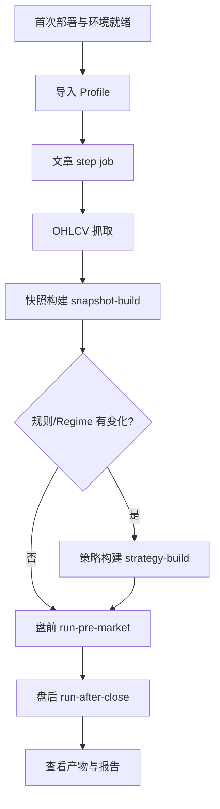

# trade-strategy-ai Web 用户手册（Admin）

> 适用范围：以 **admin** 身份使用 Web 管理后台的交付用户。
>
> 目标：说明系统能做什么、各页面如何使用、从零完成盘前/盘后日常流程与回测流程，以及各参数含义与预期结果。

---

## 1. 系统简介

**trade-strategy-ai** 是一套面向「多交易员文章 + 交易记录」的多 Agent 交易研究与复盘系统。Web 工作台是正式产品入口，用于：

- 抓取与处理交易员文章
- 准备市场数据与候选池快照
- 构建策略版本、执行盘前准备与盘后复盘
- 离线回测与规则验真
- 审核规则池、管理配置 Profile
- 查看任务进度、产物与系统健康

**核心工作方式**：在页面上提交 **Job（任务）** → Worker 后台执行 → 在 **任务中心** 查看状态 → 在 **产物中心** 下载/预览结果。

---

## 2. 登录与权限

### 2.1 登录

1. 浏览器访问 Web 地址（部署后通常为 `http://<host>:3000` 或本机 `http://localhost:8000`）。
2. 进入 **登录页**，输入管理员 **API Key**（由运维在首次部署时创建）。
3. 登录成功后，侧边栏显示全部可用入口。

### 2.2 角色说明

| 角色 | 能力 |
|------|------|
| **viewer** | 查看仪表盘、任务、产物、回测结果等 |
| **operator** | 在 viewer 基础上，可提交大部分业务 Job（盘前、盘后、回测、快照等） |
| **admin** | 全部权限，含系统管理、备份恢复、Kaipan、用户管理等 |

本手册按 **admin** 编写；admin 可执行所有页面上的操作。

### 2.3 侧边栏导航

| 分组 | 页面 | 路径 | 作用 |
|------|------|------|------|
| 正式入口 | 仪表盘 | `/dashboard` | 系统健康、告警、最近任务/产物摘要 |
| 正式入口 | 告警中心 | `/alerts` | 告警历史、确认/解决、测试告警 |
| 正式入口 | 任务 | `/jobs` | 长时间运行任务列表与详情 |
| 业务工作台 | 文章 | `/articles` | 文章抓取与处理 |
| 业务工作台 | 市场数据 | `/market` | OHLCV、快照、Kaipan 等市场数据 |
| 业务工作台 | 策略 | `/strategies` | 策略版本、盘前、盘后 |
| 业务工作台 | 回测 | `/backtest` | 离线回测与规则验真 |
| 业务工作台 | 规则池 | `/rule-pool` | 规则审核与适用性画像 |
| 业务工作台 | 产物 | `/artifacts` | 日志、报告、JSON 等输出 |
| 配置与管理 | 配置管理 | `/profiles` | Profile 配置 CRUD 与快照 |
| 配置与管理 | 系统管理 | `/system` | 健康检查、用户、备份、审计（仅 admin） |

---

## 3. 首次使用：环境就绪检查

在执行业务流程前，确认以下项已完成（部署细节见 [`web-deployment-operation.md`](web-deployment-operation.md)）：

| 检查项 | 如何确认 |
|--------|----------|
| API 与 Worker 已启动 | `/dashboard` 系统健康为正常；或访问 `/system/health` |
| 数据库已迁移 | `/system/db-migrate` 无待执行迁移（或部署时已执行） |
| 管理员账号可用 | 能正常登录 Web |
| Profile 已导入 | `/profiles` 中存在 `validated` 状态的 Profile |
| Worker 在运行 | 提交 Job 后状态会从 `pending` 变为 `running` |

---

## 4. 配置管理（Profile）

Profile 是策略、盘前、盘后、回测、文章等业务的 **统一运行上下文**。优先使用 `profile_id`，而不是直接写配置文件路径。

> 口径说明：`config/app.yaml` 和交付模板 `config/app.template.yaml` 只用于首次导入 Profile。导入完成后，Web 日常运行只认 Profile / Profile snapshot，`config_path` 仅保留给 CLI 调试与历史兼容。
> 其中 `strategy` 和 `risk` 配置也包含在这份单文件模板内，不再要求用户单独维护 `strategy.yaml` / `risk.yaml`。

### 4.1 导入 Profile

1. 进入 **配置管理** → **导入**（`/profiles/import`）。
2. 填写 `config_path`（通常为 `config/app.yaml` 或 `config/app.template.yaml`）及 Profile 名称。
3. 提交后系统生成 Profile 及配置快照。
4. 在 Profile 列表确认 `validation_status` 为 **validated**。

### 4.2 Profile 详情与编辑

- **详情页**（`/profiles/:profileId`）：查看 sections、关联 Job、历史快照。
- **编辑页**（`/profiles/:profileId/edit`）：修改配置段；admin 可归档 Profile。
- **快照页**：每次导入/保存会生成快照，供策略构建时引用。

### 4.3 策略相关 Profile Sections

策略构建依赖以下配置段（在 Profile 中维护）：

| Section | 含义 |
|---------|------|
| `top_symbols` | 重点关注的标的 |
| `style_cluster_ids` | 风格聚类 ID |
| `concept_tags` | 概念标签 |
| `strategy_preference` | 策略偏好 |
| `risk_style` | 风险风格 |
| `theme_preference` | 主题偏好 |
| `position_bias` | 仓位倾向 |

---

## 5. 页面功能说明

### 5.1 仪表盘（`/dashboard`）

**作用**：运维总览，不执行业务 Job。

- 系统健康、数据库状态、失败/成功任务数
- 产物数量、告警摘要
- 最近任务与最近产物（可跳转详情）
- 快速入口：告警中心、任务中心、配置管理、市场数据、策略工作台、系统审计、产物中心

**建议使用场景**：每天开始工作前扫一眼，确认无大量失败任务或告警。

---

### 5.2 告警中心（`/alerts`）

**作用**：集中查看告警状态、历史记录，并对已触发的告警做确认/解决/测试。

| 功能 | 说明 |
|------|------|
| 状态摘要 | 显示 `alerting.enabled`、当前通道、Webhook 是否配置 |
| 告警历史 | 查看最近告警，支持按状态、级别、标签筛选 |
| 告警处理 | 对告警执行 `确认`、`解决` |
| 配置验证 | 发送测试告警，验证 Webhook 是否可用 |

**使用顺序**：

1. 先在部署配置里确认 `alerting.enabled=true`，并为对应通道配置 Webhook。
2. 登录 Web 后打开 **告警中心**。
3. 先看状态卡片，确认当前通道是否已就绪。
4. 如果 `Webhook` 未配置，先回到部署配置修正；页面会只显示历史，不会真正发送测试告警。
5. 点击 **发送测试告警** 验证通知链路。
6. 告警真正触发后，在列表里执行 **确认** 或 **解决**。

**页面提示规则**：

- `alerting.enabled=false` 时，页面会提示告警功能未启用，测试告警按钮不可用。
- `alerting.enabled=true` 但 `Webhook` 未配置时，页面仍可看历史，但测试告警和外部推送不会真正发送。
- `console_output=true` 仅表示会输出到本地日志，不等于外部通知已配置。

**预期结果**：

- 能明确看到告警是否启用、当前通道是否配置完成
- 能用测试告警验证通知链路
- 能查看真实告警历史并标记处理状态

---

### 5.3 任务中心（`/jobs`）

**作用**：所有长时间运行任务的统一入口。

| 功能 | 说明 |
|------|------|
| 列表筛选 | 按 `status`、`job_type`、`created_by` 过滤 |
| 自动刷新 | 运行中任务约每 5 秒刷新 |
| 任务详情 | 参数、结果 payload、日志、关联产物 |
| 任务控制 | 支持 `pause / resume / cancel / retry`，仅对对应 Job 能力开放 |
| 暂停状态 | `paused` 会在列表、详情和筛选中单独显示 |

**排错路径**：任何页面提交 Job 后 → 进入 `/jobs/:jobId` → 查看日志与错误 → 跳转关联产物。

---

### 5.4 产物中心（`/artifacts`）

**作用**：查看、预览、下载 Job 产生的文件。

常见产物类型：

| kind | 说明 |
|------|------|
| `result-json` | 结构化结果摘要（盘前/盘后/回测等） |
| `report-markdown` | Markdown 报告 |
| `html` | HTML 可视化报告 |
| `records-csv` | 回测交易明细 |
| `snapshot-json` | 市场快照 |
| `snapshot-summary-json` | 快照摘要 |
| `snapshot-quality-json` | 快照质量报告 |
| `validation-report-markdown` | 规则验真报告 |

---

### 5.5 文章工作台（`/articles`）

**作用**：从交易员站点抓取文章 → 清洗 → 结构化入库。

| 子页面 | 路径 | 作用 |
|--------|------|------|
| 工作台首页 | `/articles` | 六个子入口导航 |
| 抓取与处理 | `/articles/run` | 选择 step，生成对应 job |
| 文章列表 | `/articles/list` | 按作者/来源/交易员/日期浏览 |
| 数据质量 | `/articles/quality` | 摘要、标签、去重、新鲜度 |
| 最近任务 | `/articles/jobs` | 文章相关 Job |
| 处理结果 | `/articles/results` | 最近结构化输出 |
| 高级维护 | `/articles/maintenance` | 重跑、失败重试、清理 |

#### 文章工作台使用顺序

1. 先在页面顶部选择 **Profile**，这会决定本次运行的上下文。
2. 选择一个 step。
3. 按该 step 的参数 schema 填写参数。
4. 点击提交，系统自动生成对应 Job。
5. 打开 **任务中心** 查看进度、日志和结果。

#### step 与作用

| step | 作用 | 说明 |
|------|------|------|
| `crawl` | 抓取文章 | 从来源站点拉取原始文章数据 |
| `clean` | 清洗文章 | 去噪、规范化、拆解文本 |
| `validate` | 校验文章 | 检查结构完整性与质量 |
| `store` | 入库 | 将处理结果写入数据库 |
| `process` | 生成最终结构化输出 | 产出供策略、规则池使用的数据 |

#### 常用参数

| 参数 | 含义 |
|------|------|
| `force` | 强制重跑；会删除旧状态后重新开始 |
| `max_articles` | 最多处理文章数；留空时使用默认值 |
| `skip_crawl` | 跳过抓取，仅处理已有数据 |
| `new_version` | 生成新版本 |

> 说明：`use_db` 和 `config_path` 属于系统内部兼容参数，Web 日常操作不需要填写，页面会自动处理。

#### 失败与恢复规则

- 如果当前 step 需要的前置产物不存在，系统会提示先执行前一步。
- 不勾选 `force` 时，系统只处理上次基础上未完成的数据。
- `force` 适合重跑、清理旧状态或修复异常链路。

**预期结果**：`result-json` 摘要；可选 HTML 报告；文章可在列表页浏览。

#### 定时调度

页面下方的定时区域只用于 **全量 `pipeline-run`**，不分 step。

1. 先选择 Profile。
2. 设置触发时间。
3. 可选勾选 `Force`。
4. 点击 **启动定时任务**。
5. 如果当天已经完成，且未勾选 `Force`，系统会提示“已完成”。
6. 需要停用时，点击 **停止定时任务**。

---

### 5.6 市场数据（`/market`）

**作用**：准备盘前/策略构建所需的市场数据。

| 子页面 | 路径 | 作用 |
|--------|------|------|
| 总览 | `/market` | 快照/数据集统计、失败 Job、快捷入口 |
| 市场快照 | `/market/snapshots` | 快照列表、质量、派生特征 |
| 市场数据集 | `/market/datasets` | 数据集分页浏览 |
| Kaipan 数据 | `/market/kaipan` | Kaipan 抓取/归一化/调度（admin） |
| OHLCV 行情 | `/market/ohlcv` | 日线 OHLCV 抓取 |

#### OHLCV 行情（`/market/ohlcv`）

**作用**：为盘前、回测、快照构建准备日线行情数据。

**使用顺序**：

1. 选择 Profile。
2. 选择抓取模式。
3. `incremental`：用于日常增量更新，默认只抓当天。
4. `full`：用于历史回补，填写 `start_date` / `end_date`。
5. 提交 `ohlcv-crawl` 后到 **任务中心** 查看进度。

| 参数 | 必填 | 含义 |
|------|------|------|
| `profile_id` | 二选一 | Profile ID（优先） |
| `config_path` | 二选一 | 配置文件路径 |
| `symbols` | 是 | 标的列表 |
| `mode` | 否 | `incremental`（增量，默认）/ `full`（全量回补） |
| `start_date` / `end_date` | 否 | 抓取日期区间 |
| `limit` | 否 | 最多抓取标的数 |

**结果规则**：

- 数据按 `symbol + trade_date` 增量写入，不会整表清空。
- 同一标的同一天重复抓取时，会更新已有记录。

#### Kaipan 数据（`/market/kaipan`）

**作用**：抓取 Kaipan 原始数据、归一化并支持定时调度。

**使用顺序**：

1. 选择 Profile。
2. 如需一次性执行，提交 `kaipan-fetch` 或 `kaipan-normalize`。
3. 如需长期调度，设置调度时间后点击 **启动**。
4. 运行中可到 **任务中心** 看进度。
5. 不再需要时点击 **停止**。

| Job | 作用 | 说明 |
|-----|------|------|
| `kaipan-fetch` | 抓取 Kaipan 原始数据 | 从数据源获取原始记录 |
| `kaipan-normalize` | 归一化为统一格式 | 将原始数据转成系统可用结构 |
| `kaipan-run` | 一键运行或启动调度器 | 实际上用于启动/停止调度，不是历史全量重跑 |

#### 市场状态构建（`market-state-build`）

| 参数 | 必填 | 含义 |
|------|------|------|
| `config_path` | 是 | 配置文件路径 |
| `benchmark_symbol` | 是 | 基准指数代码（如 `000300.SH`） |
| `as_of` | 否 | 基准日期 |
| `from_akshare` | 否 | 是否从 AkShare 构建 |
| `cache_csv` | 否 | 是否缓存 CSV |

#### 快照构建（`snapshot-build`）

| 参数 | 必填 | 含义 |
|------|------|------|
| `profile_id` | 二选一 | Profile ID |
| `config_path` | 二选一 | 配置文件路径 |
| `date` | 二选一 | 单日快照日期 |
| `start_date` + `end_date` | 二选一 | 区间快照 |
| `benchmark_symbol` | 否 | 基准指数 |
| `slot` | 否 | 时间槽（默认 `17-30`） |
| `snapshot_type` | 否 | `all` / `hot_topics` 等 |
| `force` | 否 | 强制重建 |
| `offline` | 否 | 离线模式 |

---

### 5.7 策略工作台（`/strategies`）

**作用**：策略版本构建、盘前准备、盘后复盘的全流程中心。

| 子页面 | 路径 | 作用 |
|--------|------|------|
| 工作台首页 | `/strategies` | 摘要、流程入口、最近 Job |
| 盘前准备 | `/strategies/pre-market` | 快照构建 + 盘前运行 |
| 盘后复盘 | `/strategies/after-close` | 盘后考核与归因 |
| 策略版本 | `/strategies/versions` | 构建与查看策略版本 |
| 候选版本 | `/strategies/candidates` | 候选版本生成与审核 |
| 规则选择 | `/strategies/regime-selection` | Regime-aware 规则选择视图 |
| 运行历史 | `/strategies/history` | 策略相关 Job 历史 |

**使用前提**：

- Profile 已导入且为 `validated`
- 文章流程已完成，至少有可用结构化数据
- OHLCV 与快照数据已准备好

**策略 Pipeline 逻辑顺序**：

```text
strategy-build → run-pre-market → run-after-close
```

**推荐操作顺序**：

1. 当 Profile、规则、快照或 Regime 发生变化时，先执行 `strategy-build`。
2. 每个交易日开盘前执行 `run-pre-market`。
3. 收盘后执行 `run-after-close`。
4. 在 `/strategies/history` 或 `/jobs` 查看执行结果和日志。

日常使用时 **不必每天重建策略版本**；只有输入发生变化时才需要重新 `strategy-build`。

---

### 5.8 回测工作台（`/backtest`）

**作用**：对历史数据进行离线回测，评估策略表现。

| 子页面 | 路径 | 作用 |
|--------|------|------|
| 回测中心 | `/backtest` | 提交回测、查看结果 |
| Regime 回测 | `/backtest/regime` | Regime-aware 回测报告 |

**回测 Pipeline**：

```text
backtest-run →（可选）backtest-validate-rules / backtest-reproducibility-check
```

**使用顺序**：

1. 选择 Profile。
2. 选择 `trader_id`、`date_from`、`date_to` 和 `strategy_version_id`。
3. 如需限定标的，填写 `symbols`；如需指定基准，填写 `benchmark_symbol`。
4. 保持 `use_snapshot_only=true`，由系统只使用快照数据。
5. 提交 `backtest-run`。
6. 结果出来后查看摘要指标、报告和交易明细。
7. 如需规则验真，继续提交 `backtest-validate-rules`。
8. 如需检查稳定性，提交 `backtest-reproducibility-check`。

**常用参数说明**：

| 参数 | 含义 |
|------|------|
| `profile_id` | 运行上下文，优先使用 |
| `trader_id` | 交易员 ID |
| `date_from` / `date_to` | 回测区间 |
| `strategy_version_id` | 策略版本 ID |
| `symbols` | 参与回测的标的列表 |
| `benchmark_symbol` | 基准指数 |
| `mode` | 回测模式 |
| `use_snapshot_only` | 固定为 `true`，Web 不可改 |
| `scoring_profile` | 评分口径 |

**结果判读**：

- `result-json` 会给出摘要指标和 fingerprint
- `report-markdown` 适合人工阅读
- `records-csv` 适合进一步分析
- `validation-report-markdown` 用于规则验真

---

### 5.9 规则池（`/rule-pool`）

**作用**：审核从文章/策略中提取的交易规则。

**使用顺序**：

1. 打开列表页，按 `status`（默认 pending）、`rule_type`、`mapping_status` 筛选。
2. 进入规则详情查看原文证据与抽取结果。
3. 生成或审核适用性画像（Rule Applicability Profile）。
4. 确认需要验证的规则后，提交 `rule-pool-backtest`。
5. 在任务中心查看回测任务状态和结果。
6. 结合回测结果决定是否保留、修改或淘汰规则。

**详情页能看到**：

- 规则内容
- 证据片段
- 适用性画像
- 回测入口（admin，需二次确认）

**规则池回测参数**：

| 参数 | 含义 |
|------|------|
| `rule_id` | 规则 ID |
| `start_date` / `end_date` | 回测区间 |
| `min_confidence` | 最低置信度 |
| `market_regime_version` | 市场状态版本 |

---

### 5.10 系统管理（`/system`，admin only）

| 子页面 | 路径 | 作用 |
|--------|------|------|
| Hub | `/system` | 运维入口汇总 |
| 权限与审计 | `/system/audit` | 高风险操作、权限拒绝记录 |
| 用户管理 | `/system/users` | 增删用户、改角色、改密 |
| 系统健康 | `/system/health` | API、DB、Worker、存储状态 |
| 数据库迁移 | `/system/db-migrate` | 触发 `db-migrate`（高风险） |
| 数据备份与恢复 | `/system/backup` | 项目级备份/恢复 |

> 补充说明：系统健康页里会显示 `运行配置` 和 `Profile 上下文` 两块信息。`运行配置` 表示当前进程加载的 `config_path`；`Profile 上下文` 只表示启动环境显式注入的 `PROFILE_ID` / `PROFILE_SNAPSHOT_ID`，如果没有注入就显示 `未绑定`，不代表业务 Profile 丢失。

---

## 6. 从零开始：盘前 + 盘后完整流程

以下是从全新环境到获得当日盘前/盘后结果的 **推荐操作顺序**。

### 流程总览



---

### Step 0：首次环境就绪

1. 完成部署（见运维手册）。
2. 执行数据库迁移、创建 admin 用户。
3. 确认 Worker 在运行。

---

### Step 1：导入 Profile

1. 打开 **配置管理** → **导入**。
2. 从 `config/app.yaml` 导入 Profile。
3. 确认 validation 状态为 `validated`。
4. 记录 `profile_id`（后续步骤会用到）。

---

### Step 2：准备文章数据（首次或需要更新时）

1. 打开 **文章** → **抓取与处理**（`/articles/run`）。
2. 选择 Profile。
3. 选择一个 step：
   - 日常抓取：`crawl`
   - 清洗：`clean`
   - 校验：`validate`
   - 入库：`store`
   - 生成最终输出：`process`
4. 按页面显示的参数填写表单：
   - `force`：重跑或修复异常时勾选
   - `max_articles`：需要限制数量时填写
   - `skip_crawl` / `new_version`：按页面提示使用
5. 提交对应 Job。
6. 在 **任务中心** 等待完成。
7. 在 **文章列表** 确认文章已入库；在 **数据质量** 检查摘要。

**预期结果**：文章结构化数据入库，供后续策略与规则提取使用。

---

### Step 3：准备市场数据

1. 打开 **市场数据** → **OHLCV 行情**（`/market/ohlcv`）。
2. 选择 Profile，填写：
   - `symbols`：关注标的列表（如 `600519.SH,000001.SZ`）
   - `mode`：`incremental`
   - 日期区间：按需设置
3. 提交 `ohlcv-crawl` Job，等待完成。

4. （可选）打开 **市场数据** 总览或盘前页，提交 **快照构建**：
   - `profile_id`：你的 Profile
   - `date`：策略日期（如今日）
   - `slot`：`17-30`（默认）
   - `snapshot_type`：`all`

**预期结果**：
- OHLCV 日线数据就绪
- `snapshot-json`、`snapshot-summary-json`、`snapshot-quality-json` 产物

5. 在 **市场快照** 页确认快照质量可接受。

---

### Step 4：构建策略版本（规则/Regime/快照变化时）

> 若已有对应日期的策略版本，可跳过此步。

1. 打开 **策略** → **规则选择**（`/strategies/regime-selection`），查看 Regime 规则选择结果。
2. 打开 **策略版本**（`/strategies/versions`）。
3. 填写参数并提交 **`strategy-build`**：

| 参数 | 必填 | 含义 |
|------|------|------|
| `profile_id` | 推荐 | Profile ID |
| `trader_id` | 是 | 交易员 ID（如 `trader_a`） |
| `strategy_date` | 是 | 策略日期 |
| `snapshot_id` | 否 | 快照 ID；留空则用 Profile 最新快照 |
| `market_regime_version` | 否 | 市场状态版本（默认 `market-regime-v3`） |
| `source_feature_version` | 否 | Regime 特征版本（默认 `market-regime-features-v3`） |
| `applicability_profile_version` | 否 | 规则适用性画像版本 |
| `selected_by` | 否 | 选择来源（默认 `web`） |
| `force` | 否 | 强制重建 |

4. 等待 Job 完成，记录生成的 **策略版本 ID**。

**预期结果**：
- `result-json`：策略版本摘要
- 可选 `regime-selection-json`、HTML 报告

#### 4.1 策略版本状态说明

`strategy-build` 提交完成后，系统会先生成一个 **draft 草稿版本**，它还不是盘前/回测会自动消费的正式版本。

| 状态 | 含义 | 是否可直接用于盘前/回测 |
|------|------|------------------------|
| `draft` | 已构建完成，等待人工审核 | 否 |
| `released` | 已人工确认并发布 | 是 |

**Release 操作说明**：

1. 先在 **策略版本** 页面检查 `draft` 版本的推荐、规则快照和证据链。
2. 确认内容无误后，再执行人工 `Release`。
3. `Release` 完成后，版本状态变为 `released`，盘前准备、回测和其他主流程才会优先读取它。

**注意**：

- `strategy-build` 只负责生成草稿，不会自动把版本升级为 `released`。
- 如果当天没有可用的 `released` 版本，系统会直接报错，需要先完成策略版本发布。
- 日常操作中，请把 `released` 版本视为“正式可用版本”，把 `draft` 版本视为“待审核版本”。

---

### Step 5：盘前准备

1. 打开 **策略** → **盘前准备**（`/strategies/pre-market`）。
2. 选择 Profile、**Strategy date**（策略日期）、Benchmark（页面默认选中沪深300，可手动切换）。
3. 若当日快照尚未构建，先提交 **快照构建**（参数见 Step 3）。
4. 提交 **`run-pre-market`**：

| 参数 | 含义 |
|------|------|
| `profile_id` | Profile ID |
| `as_of_date` | 执行日期（= 策略日期） |
| `benchmark_symbol` | 基准指数（页面默认已选中，如 `000300.SH`） |
| `force` | 强制执行 |
| `export_html` | 是否导出 HTML 报告 |

5. 在任务详情等待完成。

**预期结果**：
- `result-json`：盘前日报摘要（关注列表、市场状态、策略要点等）
- 可选 HTML 报告
- 策略首页显示最新 `run-pre-market` Job 链接

**你能得到什么**：一份面向当日的盘前准备报告，明确今日关注标的、市场环境与策略执行要点。

---

### Step 6：盘后复盘

> 通常在当日收盘后执行。

1. 打开 **策略** → **盘后复盘**（`/strategies/after-close`）。
2. 选择 Profile、**执行日期**（`as_of_date`）。
3. 可选勾选 `force`、`export_html`。
4. 提交 **`run-after-close`** Job。
5. 等待完成，在页面查看结果摘要。

**预期结果**（`result-json` 含）：

| 字段 | 含义 |
|------|------|
| `evaluations` | 各标的收益与考核状态 |
| `evidence_pack_refs` | 证据包引用 |
| `failure_categories` | 失败分类 |
| `ranking_features` | 排名特征 |
| `postmortem_notes` | 复盘笔记 |

页面还会展示：信号归因、今日表现、最近盘后 Job 列表。

**你能得到什么**：当日交易表现的结构化考核结果、归因分析与复盘材料，可用于反馈与策略优化。

---

### 日常重复流程（环境已就绪）

第二个交易日及以后，通常只需：

```text
1. （按需）ohlcv-crawl 增量更新
2. snapshot-build（当日快照）
3. （仅 Regime/规则变化时）strategy-build
4. run-pre-market
5. run-after-close
```

---

## 7. 从零开始：回测完整流程

### 7.1 前置条件

| 条件 | 说明 |
|------|------|
| Profile 已导入 | 含 trader、strategy、market 等配置 |
| 策略版本已存在 | 在 `/strategies/versions` 构建或已有历史版本 |
| 快照数据可用 | 回测 **固定使用快照数据**（`use_snapshot_only=true`） |
| OHLCV 已抓取 | 覆盖回测日期区间 |

### 7.2 操作步骤

1. 打开 **回测**（`/backtest`）。
2. 填写回测表单（见参数表）。
3. 点击 **「运行回测」** 提交 `backtest-run` Job。
4. 自动跳转或手动进入 **任务详情**，等待完成。
5. 在 **最近结果** 列表选择 `result_id`，查看摘要指标。
6. 预览或下载 Markdown 报告、CSV 明细。
7. （可选）点击 **「验证规则」** 提交 `backtest-validate-rules`。
8. （可选，admin）**「可复现性检查」** 提交 `backtest-reproducibility-check`，比对 fingerprint。

### 7.3 回测参数详解

| 参数 | 必填 | 默认值 | 含义 |
|------|------|--------|------|
| `profile_id` | 推荐 | — | 运行上下文；驱动 config_path |
| `trader_id` | 是 | — | 交易员 ID |
| `date_from` | 是 | 近 30 天 | 回测开始日期 |
| `date_to` | 是 | 今日 | 回测结束日期 |
| `strategy_version_id` | 强烈建议 | — | 绑定的策略版本 |
| `symbols` | 否 | 全部 | 标的列表，逗号/空格分隔；空=全部 |
| `benchmark_symbol` | 否 | `000300.SH` | 基准指数（沪深300） |
| `mode` | 否 | `full` | 见下表 |
| `use_snapshot_only` | 固定 | `true` | 仅使用快照数据（UI 不可改） |
| `scoring_profile` | 否 | `stage5` | 评分配置口径 |
| `config_path` | 否 | 自动 | 通常由 Profile 自动填充 |

**`mode` 取值**：

| 值 | 含义 |
|----|------|
| `full` | 全量回测 |
| `replay` | 重放模式 |
| `rule_validation` | 规则验真（`backtest-validate-rules` 默认） |

### 7.4 回测结果解读

Job 完成后，在结果列表和详情页可看到：

| 指标 | 含义 |
|------|------|
| `total_days` | 回测覆盖交易日数 |
| `total_trades` | 总交易笔数 |
| `valid_trades` | 有效交易笔数 |
| `skipped_trades` | 跳过笔数（缺数据等） |
| `win_rate` | 胜率 |
| `avg_return_pct` | 平均收益率 |
| `fingerprint` | 结果指纹，用于可复现性比对 |

**产物**：

| kind | 用途 |
|------|------|
| `result-json` | 结构化摘要，含 fingerprint |
| `report-markdown` | 人类可读报告，可下载 |
| `records-csv` | 逐笔交易明细 |
| `validation-report-markdown` | 规则验真报告 |

**Regime 回测**：打开 `/backtest/regime` 查看按市场状态分段的回测报告。

**你能得到什么**：在指定日期区间内，某策略版本的历史表现评估，包括胜率、收益、交易明细，以及（可选）规则验真与可复现性验证。

---

## 8. 候选版本与策略优化

1. 打开 **策略** → **候选版本**（`/strategies/candidates`）。
2. 提交 **`optimize-create-candidate`** 生成候选版本。
3. 在列表中审核，提交 **`candidate-review`**（高风险，需二次确认）：
   - `candidate_version_id`：候选版本 ID
   - `decision`：审核决定
   - `reviewed_by`：审核人

---

## 9. 统一排错指南

无论哪个页面出问题，按以下顺序排查：

```text
1. /dashboard 或 /system/health — 系统是否正常
2. /jobs — 找到失败 Job，查看日志
3. /artifacts — 查看是否有部分产物
4. /profiles — 确认 Profile 与快照有效
5. /system/audit — 查看是否有权限拒绝或高风险操作记录
```

**常见问题**：

| 现象 | 可能原因 | 处理 |
|------|----------|------|
| Job 一直 pending | Worker 未启动 | 启动 Worker，见运维手册 |
| 权限拒绝 | 角色不足 | 确认使用 admin 账号 |
| 回测 skipped 多 | 快照/OHLCV 缺数据 | 补抓数据后重跑 |
| 盘前/盘后失败 | Profile 或快照无效 | 检查 Profile validation 与 snapshot-build |
| 页面空白/401 | API Key 失效 | 重新登录 |

---

## 10. Admin 专属操作速查

| 操作 | 入口 | Job 类型 |
|------|------|----------|
| 用户管理 | `/system/users` | — |
| 数据库迁移 | `/system/db-migrate` | `db-migrate` |
| 项目备份 | `/system/backup` | `backup-data` |
| 项目恢复 | `/system/backup` | `restore-data` |
| Kaipan 抓取 | `/market/kaipan` | `kaipan-*` |
| 回测可复现性 | `/backtest` | `backtest-reproducibility-check` |
| 规则池回测 | `/rule-pool/:ruleId` | `rule-pool-backtest` |
| Profile 归档 | `/profiles/:id/edit` | — |

---

## 11. Job 类型速查表

| job_type | 页面入口 | 用途 |
|----------|----------|------|
| `pipeline-run` | 文章 | 文章完整处理链路 |
| `ohlcv-crawl` | 市场数据 | OHLCV 抓取 |
| `market-state-build` | 市场数据 | 市场状态 |
| `snapshot-build` | 市场数据 / 盘前 | 候选池快照 |
| `strategy-build` | 策略版本 | 构建策略版本 |
| `run-pre-market` | 盘前 | 盘前日报 |
| `run-after-close` | 盘后 | 盘后考核 |
| `backtest-run` | 回测 | 离线回测 |
| `backtest-validate-rules` | 回测 | 规则验真 |
| `backtest-reproducibility-check` | 回测 | 可复现性（admin） |
| `rule-pool-backtest` | 规则池 | 单规则回测（admin） |
| `backup-data` | 系统管理 | 项目备份 |
| `restore-data` | 系统管理 | 项目恢复 |
| `db-migrate` | 系统管理 | 数据库迁移 |

---

## 12. 按角色的最小操作清单

### 12.1 admin 日常清单

1. 登录 Web，确认 `/dashboard` 正常。
2. 进入 `/profiles` 检查当前 Profile 是否为 `validated`。
3. 进入 `/articles/run`，按需要运行文章 step。
4. 进入 `/market/ohlcv` 更新 OHLCV。
5. 进入 `/market/kaipan` 执行或检查 Kaipan 调度。
6. 进入 `/market/snapshots` 确认快照质量。
7. 进入 `/strategies/pre-market` 执行盘前准备。
8. 收盘后进入 `/strategies/after-close` 执行盘后复盘。
9. 进入 `/jobs` 查看失败任务、暂停任务和重试状态。
10. 进入 `/artifacts` 查看结果文件。

### 12.2 operator 日常清单

1. 登录 Web。
2. 打开 `/dashboard` 确认系统正常。
3. 在允许的业务页面提交 Job。
4. 到 `/jobs` 查看执行进度与日志。
5. 在 `/artifacts` 查看结果产物。

### 12.3 viewer 日常清单

1. 登录 Web。
2. 只查看 `/dashboard`、`/jobs`、`/artifacts`、`/backtest` 等只读页面。
3. 通过任务详情和产物判断结果是否可用。

---

## 13. 页面成功标准与常见问题

### 13.1 `/articles/run`

**成功标准**

- 能选择 Profile
- 能选择 step
- 提交后生成对应 Job
- Job 进入 `running` 并最终结束为 `success`

**常见问题**

- 没有可选 step：通常是页面加载失败或后端工作流未就绪
- 提示先执行前一步：前置产物不存在，先回到前一步执行
- Job 卡住：去 `/jobs` 看日志，检查 Worker 是否运行

### 13.2 `/market/ohlcv`

**成功标准**

- 能提交 `ohlcv-crawl`
- 日常增量场景会只更新当天或当前区间
- 任务完成后可在数据集或快照流程里使用

**常见问题**

- 抓取耗时过长：属于大区间历史回补的正常现象
- 标的为空：先确认 `symbols` 是否填写正确

### 13.3 `/market/kaipan`

**成功标准**

- 能启动或停止调度
- 能分别提交 `kaipan-fetch` 和 `kaipan-normalize`
- 状态区域能正确显示当前是否运行中

**常见问题**

- 启动后没有任务执行：检查调度时间和 Worker 状态
- 同一天数据已存在：未勾选 `Force` 时系统会提示已完成

### 13.4 `/strategies/pre-market` 和 `/strategies/after-close`

**成功标准**

- 能基于当前 Profile 提交任务
- 能生成结果摘要和报告
- 最近任务列表能看到新 Job

**常见问题**

- 提示快照不存在：先执行 `snapshot-build`
- 提示 Profile 无效：去 `/profiles` 检查 validation 状态

### 13.5 `/backtest`

**成功标准**

- 能提交 `backtest-run`
- 能看到摘要指标、报告和交易明细
- 必要时可继续做规则验真或 fingerprint 检查

**常见问题**

- `skipped` 很多：通常是快照或 OHLCV 缺数据
- 结果不稳定：检查是否需要复现性检查

---

## 14. 附录：典型工作日时间线

| 时间 | 操作 | 页面 |
|------|------|------|
| 开盘前 | 检查仪表盘、增量 OHLCV、构建快照 | `/dashboard`, `/market/ohlcv` |
| 开盘前 | 盘前运行 | `/strategies/pre-market` |
| 盘中 | 查看盘前报告产物 | `/artifacts` |
| 收盘后 | 盘后运行 | `/strategies/after-close` |
| 收盘后 | 查看考核结果、归因 | `/strategies/after-close`, `/artifacts` |
| 周末/按需 | 回测、规则池审核 | `/backtest`, `/rule-pool` |

---

*文档版本：与当前 Web 正式入口（V2 IA）对齐。部署与运维见 [`web-deployment-operation.md`](web-deployment-operation.md)。*
